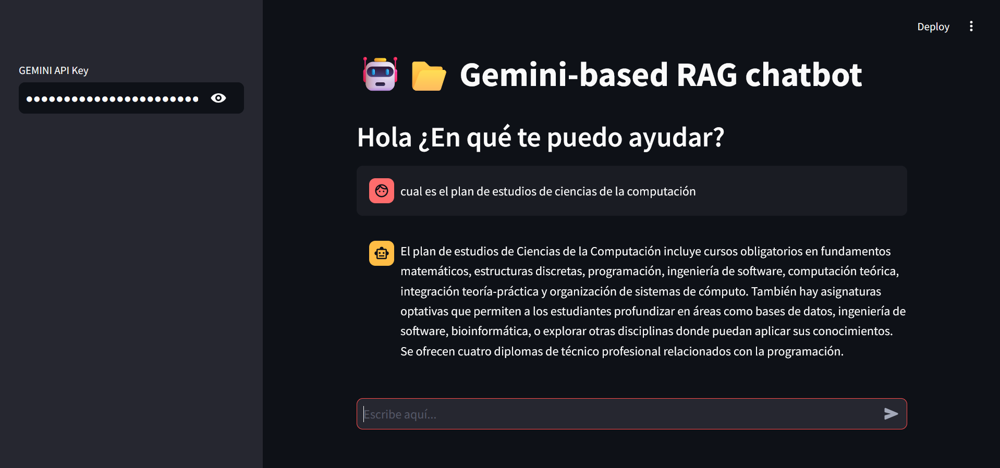

# 🤖📂 Gemini-based RAG chatbot

Esta aplicación es un chatbot basado en el modelo **Gemini** de **Google**, diseñado para responder preguntas sobre los planes de estudio de una universidad utilizando un enfoque de **Retrieval-Augmented Generation (RAG)**. 
Para este caso se obtuvieron **19 planes de estudios** de algunas carreras de la **Universida Atónoma de México**.
La aplicación extrae información relevante de una base de datos de documentos y utiliza un modelo generativo para crear respuestas útiles y detalladas para el usuario.

## Funcionalidad

- **Interacción Conversacional**: Los usuarios pueden interactuar con el chatbot de manera conversacional, haciendo preguntas sobre los planes de estudio de una universidad.
- **Generación de Respuestas con RAG**: El chatbot usa un modelo de **Generación de Texto** para obtener respuestas precisas basadas en los documentos relevantes recuperados de una base de datos.
- **Acceso a Documentos**: El sistema almacena y consulta documentos sobre los planes de estudio a través de una base de datos **ChromaDB**.
- **Respuestas Detalladas**: El modelo está diseñado para desglosar conceptos complejos y responder de manera amigable, asegurándose de que la audiencia no técnica entienda las respuestas.

## Requisitos

Para ejecutar esta aplicación se utilizó Python 3.13.0 y las siguientes bibliotecas:

- `streamlit`
- `google-generativeai`
- `chromadb`
- `re` (incluida por defecto en Python)
- `PyPDF2`
- `langchain`

Para una mejor compatibilidad utilizar el documento requirements.txt

## Instalación

1. Clona el repositorio o descarga el código fuente.
2. Instala las dependencias necesarias ejecutando el siguiente comando:

   ```bash
   pip install -r requirements.txt
   ```

3. Asegúrate de tener una clave API de **Gemini** para usar el modelo generativo de Google. (https://ai.google.dev/gemini-api/docs/api-key) para obtener tu clave API.

4. Coloca tu clave API en el archivo de configuración o ingrésala en el panel lateral de la aplicación en la interfaz de Streamlit segun la versión que utilices (Checar ramas para diferentes versiones).

## Ejecución

1. Entra a la carpeta del proyecto y ejecuta el siguiente comando para crear una base de datos persistentes:

   ```bash
   python create_db.py
   ```

Asegurate de contar con la carpeta pdfs -> modificar para cambiar el contenido de la base de datos.

2. Ejecuta la aplicacion del chatbot con el siguiente comando 

   ```bash
   streamlit run chatbot.py
   ```

   El programa se ejecuta de manera local en el puerto 8501. 

   Si se quiere modificar el puerto o la red, utilice el siguiente comando.

   ```bash
   streamlit run app.py --server.address 0.0.0.0 --server.port 8502
   ``` 

2. Abre la URL local que se muestra en la terminal para interactuar con la aplicación en tu navegador.

## Uso



1. Al abrir la aplicación, verás un título y un encabezado que te invitarán a hacer preguntas.
2. En el panel lateral (sidebar), podrás ingresar tu **API Key** de Gemini para habilitar el modelo generativo.
3. A medida que haces preguntas en el cuadro de texto, el chatbot utilizará la base de datos de **ChromaDB** para obtener información relevante sobre los planes de estudio y generar una respuesta detallada y clara.
4. Las respuestas del chatbot serán mostradas en la interfaz en tiempo real.

## Arquitectura

La aplicación utiliza los siguientes componentes principales:

- **Streamlit**: Interfaz de usuario para la interacción en tiempo real con el chatbot.
- **Gemini Generative AI**: Modelo de generación de texto utilizado para generar respuestas.
- **ChromaDB**: Base de datos que almacena documentos sobre planes de estudio. Se utiliza para realizar consultas de texto y recuperar la información relevante.
- **Prompting**: Se utiliza un esquema de **Retrieval-Augmented Generation (RAG)** para mejorar la precisión de las respuestas.


## Referencias

Este proyecto se construyó con el apoyo de las siguientes referencias.

1. https://medium.com/@saurabhgssingh/understanding-rag-building-a-rag-system-from-scratch-with-gemini-api-b11ad9fc1bf7
2. https://github.com/google-gemini/gemma-cookbook/blob/main/Gemma/RAG_with_ChromaDB.ipynb
